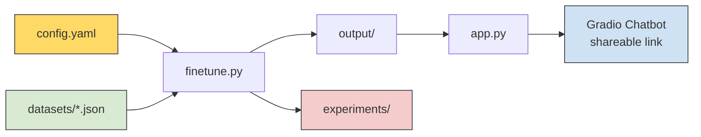
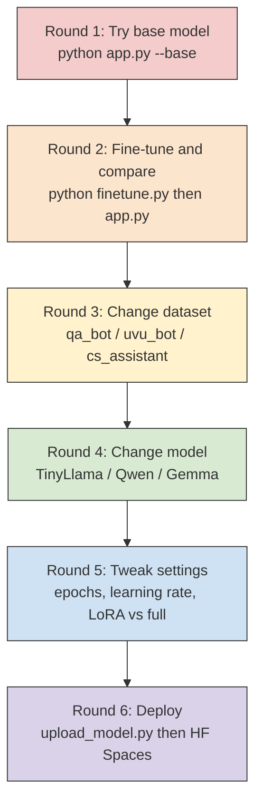
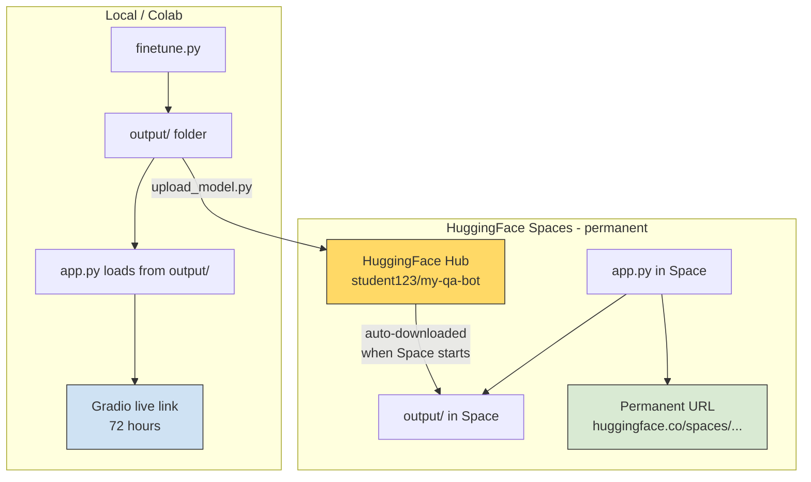

# NLP Fine-Tuning Chatbot — Learning Guide

## Table of Contents

1. [How This Project Works](#1-how-this-project-works)
2. [Suggested Workflow](#2-suggested-workflow)
3. [Understanding Fine-Tuning Methods](#3-understanding-fine-tuning-methods)
4. [Working with Data](#4-working-with-data)
5. [Deploying Your Chatbot](#5-deploying-your-chatbot)
6. [Further Reading](#6-further-reading)

---

## 1. How This Project Works



| Step | What happens |
|------|-------------|
| Edit `config.yaml` | Pick your model, dataset, and training method |
| Run `finetune.py` | Trains the model, saves it to `output/`, logs results to `experiments/` |
| Run `app.py` | Loads the model from `output/` and launches a Gradio chat interface |

**Key point:** `app.py` always loads the fine-tuned model from the `output/` folder. Whether you run locally, on Colab, or on HuggingFace Spaces — the model must be in `output/` for the chatbot to work.

---

## 2. Suggested Workflow



### Round 1: See the base model (no training)

```bash
python app.py --base
```

Chat with the **untrained** base model. Ask it questions from your dataset (e.g., "What are UVU's admission requirements?"). Notice how it gives generic or incorrect answers — it has never seen your data.

### Round 2: Fine-tune and compare

```bash
python finetune.py
python app.py
```

Now ask the **same questions**. The model should give much better answers because it learned from your dataset. Check `experiments/` to see the before/after comparison.

### Round 3: Change the dataset

Go back to `config.yaml`, switch to a different dataset (e.g., `cs_assistant.json`), and repeat. Compare how the same model behaves with different training data.

### Round 4: Change the model

Try a different model (e.g., `Qwen/Qwen3-0.6B` or `google/gemma-4-e2b`). Same dataset, different model. How does size affect quality?

### Round 5: Tweak training settings

Try more epochs, different learning rates, or LoRA vs full fine-tuning. Use the experiment comparison (notebook Step 8) to see what matters most.

### Round 6: Deploy for your portfolio

```bash
python upload_model.py
```

Push your best model to HuggingFace and create a permanent Space. See [Section 5](#5-deploying-your-chatbot) for full instructions.

---

## 3. Understanding Fine-Tuning Methods

### What is Fine-Tuning?

> **Fine-tuning** takes a pre-trained model (one that already understands language) and trains it further on your specific dataset. Instead of learning language from scratch, the model learns to specialize in your task — like teaching a chef a new recipe instead of teaching them how to cook from zero.

### LoRA (Low-Rank Adaptation)

**LoRA** is a *technique* (not a framework or library) introduced by [Microsoft Research in 2021](https://arxiv.org/abs/2106.09685). It freezes the original model weights and inserts small, trainable matrices into the model's attention layers. Instead of updating billions of parameters, you only train a small fraction (typically 1-5%).

> **How it works:** Imagine the model's knowledge as a huge book. Instead of rewriting the entire book (full fine-tuning), LoRA adds small sticky notes in key places (attention layers) that adjust the model's behavior. The original book stays intact — you only write the sticky notes.

**Read more:** [LoRA paper](https://arxiv.org/abs/2106.09685) | [HuggingFace PEFT docs](https://huggingface.co/docs/peft)

### QLoRA (Quantized LoRA)

**QLoRA** combines LoRA with [quantization](https://huggingface.co/docs/bitsandbytes) — it first compresses the base model to use less memory (4-bit instead of 16-bit), then applies LoRA on top.

> **When to use:** If you want to fine-tune a 7B model (like Mistral) on free Colab, QLoRA makes it possible by reducing the base model's memory footprint by ~4x.

**Read more:** [QLoRA paper](https://arxiv.org/abs/2305.14314) | [bitsandbytes library](https://github.com/bitsandbytes-foundation/bitsandbytes)

### Full Fine-Tuning

**Full fine-tuning** updates *all* parameters in the model. It can produce the best results but requires significantly more GPU memory and time.

> **When to use:** Only if you have access to a powerful GPU (16GB+ VRAM) and want maximum quality. For most student projects, LoRA gives you 90-95% of the quality at a fraction of the cost.

### Comparison

| | LoRA | QLoRA | Full Fine-Tuning |
|---|---|---|---|
| **What it does** | Trains small adapter layers | LoRA + quantized base model | Trains all parameters |
| **GPU Memory** | ~4-8 GB | ~2-4 GB | 16+ GB |
| **Training Speed** | Fast | Fast | Slow |
| **Free Colab?** | Yes | Yes | Maybe (small models only) |
| **Quality** | Very Good | Good | Best |
| **Recommended** | Yes (default) | Advanced users | Advanced users |

Switch in `config.yaml`:

```yaml
training:
  method: "lora"    # or "full"
```

> **WARNING:** Full fine-tuning requires 16GB+ GPU memory. If you get an out-of-memory error, switch back to `"lora"`.

### Key Terminology

| Term | What it is |
|---|---|
| **LoRA** | A technique — the idea of inserting small trainable matrices |
| **QLoRA** | A variant of LoRA that adds quantization to save more memory |
| **PEFT** | The [Python library](https://github.com/huggingface/peft) by HuggingFace that implements LoRA and QLoRA |
| **bitsandbytes** | The [library](https://github.com/bitsandbytes-foundation/bitsandbytes) that handles quantization (used by QLoRA) |

---

## 4. Working with Data

### Using HuggingFace Datasets

You can fine-tune on any dataset from the [HuggingFace Hub](https://huggingface.co/datasets). Update `config.yaml`:

```yaml
dataset:
  # Comment out the local path:
  # path: "datasets/qa_bot.json"

  # Use a HuggingFace dataset instead:
  hf_name: "databricks/databricks-dolly-15k"
  hf_split: "train[:500]"
  hf_instruction_col: "instruction"
  hf_response_col: "response"
```

For a detailed walkthrough with multiple examples, run:

```bash
python examples/load_hf_dataset.py
```

### Creating Your Own Dataset

Create a JSON file in the `datasets/` folder with this format:

```json
[
  {
    "instruction": "Your question or prompt here",
    "response": "The ideal answer you want the model to learn"
  }
]
```

Then point to it in `config.yaml`:

```yaml
dataset:
  path: "datasets/my_custom_data.json"
```

### Tips for Good Training Data

- **Start with at least 50-100 examples.** Even 50 well-crafted examples can produce noticeable improvements.
- **Be consistent in tone and format.** The model learns to mimic the style of your data.
- **Cover diverse topics within your domain.** Don't repeat the same question with slight variations.
- **Keep responses clear and accurate.** The model will learn mistakes too.

---

## 5. Deploying Your Chatbot

### How the model connects to the chatbot

Understanding this is important before deploying:



**Key point:** `app.py` always loads from the `output/` folder. The only question is how the model gets into that folder:

| Where you run | How the model gets into `output/` |
|---------------|----------------------------------|
| **Local / Colab** | `finetune.py` saves it there directly |
| **HuggingFace Spaces (simple)** | You upload the `output/` folder with your Space files |
| **HuggingFace Spaces (clean)** | You upload model to HF Hub, Space downloads it on startup |

---

### Option A: Quick Shareable Link (Gradio Live)

This is the easiest way. When you run `python app.py`, Gradio prints a public URL:

```
Running on public URL: https://xxxxx.gradio.live
```

Anyone with the link can try your chatbot. The link stays active for **72 hours**.

**Best for:** Quick demos, sharing with classmates, screenshots for your portfolio.

**How it works:** Your fine-tuned model is loaded from `output/` on your machine (or Colab). Gradio creates a tunnel so others can access it through the public URL. When you stop the script, the link dies.

**Learn more:**
- [Sharing Your App — Gradio official guide](https://www.gradio.app/guides/sharing-your-app)
- [Understanding Gradio Share Links](https://www.gradio.app/guides/understanding-gradio-share-links)
- [Creating a Chatbot Fast — Gradio guide](https://www.gradio.app/guides/creating-a-chatbot-fast)

---

### Option B: Permanent Deployment on HuggingFace Spaces

For a permanent link on your resume, deploy to [HuggingFace Spaces](https://huggingface.co/spaces).

#### The Simple Way (upload everything)

1. Go to [huggingface.co/new-space](https://huggingface.co/new-space)
2. Name your Space (e.g., `my-qa-chatbot`), select **Gradio** as the SDK
3. Upload these files:
   - `app.py`, `config.yaml`, `data_utils.py`, `requirements.txt`
   - The entire `output/` folder (contains your fine-tuned model)
4. The Space will build and deploy automatically

**Pros:** Simple, no extra steps.
**Cons:** `output/` can be 500MB-2GB. HuggingFace free tier has 10GB storage, so it fits.

#### The Clean Way (upload model separately)

This is more professional — your model gets its own page on HuggingFace.

**Step 1: Log in to HuggingFace**

```bash
pip install huggingface_hub
huggingface-cli login
```

Get your token from [huggingface.co/settings/tokens](https://huggingface.co/settings/tokens) (create one with "Write" permission).

**Step 2: Upload your model**

```bash
python upload_model.py
```

This uploads your fine-tuned model to `your-username/your-model-name` on HuggingFace Hub.

**Step 3: Create a Space**

1. Go to [huggingface.co/new-space](https://huggingface.co/new-space)
2. Name your Space, select **Gradio**, select **CPU basic** (free)
3. Upload: `app.py`, `config.yaml`, `data_utils.py`, `requirements.txt`
4. **Do not upload `output/`** — instead, add a startup script that downloads the model.

Create a file called `setup.py` in your Space:

```python
"""Run this before app.py to download the model from HuggingFace Hub."""
import os
from huggingface_hub import snapshot_download

MODEL_ID = "your-username/your-model-name"  # Change this
OUTPUT_DIR = "output/"

if not os.path.exists(OUTPUT_DIR) or not os.listdir(OUTPUT_DIR):
    print(f"Downloading model from {MODEL_ID}...")
    snapshot_download(repo_id=MODEL_ID, local_dir=OUTPUT_DIR)
    print("Model downloaded!")
else:
    print("Model already exists in output/")
```

Then in your Space's `app.py`, add this at the very top (before any other code):

```python
import setup  # Downloads model from HuggingFace Hub on first run
```

**What you get:**
- Model page: `https://huggingface.co/your-username/your-model-name`
- Chatbot: `https://huggingface.co/spaces/your-username/my-qa-chatbot`
- Both are public and can go on your resume

**Learn more:**
- [Uploading Models to HuggingFace Hub — official docs](https://huggingface.co/docs/hub/en/models-uploading)
- [Sharing Models with push_to_hub — Transformers docs](https://huggingface.co/docs/transformers/model_sharing)
- [Upload Files to the Hub — huggingface_hub guide](https://huggingface.co/docs/huggingface_hub/guides/upload)
- [Gradio Spaces — official HuggingFace docs](https://huggingface.co/docs/hub/en/spaces-sdks-gradio)
- [Deploy Gradio Apps on HuggingFace Spaces — PyImageSearch tutorial](https://pyimagesearch.com/2024/12/30/deploy-gradio-apps-on-hugging-face-spaces/)
- [Using HuggingFace Integrations — Gradio guide](https://www.gradio.app/guides/using-hugging-face-integrations)

---

### Resume / Portfolio Description

Here is an example you can adapt:

> *Fine-tuned a TinyLlama 1.1B language model on a custom Q&A dataset using LoRA (Low-Rank Adaptation). Built an interactive chatbot interface with Gradio and deployed it to HuggingFace Spaces. Technologies: Python, PyTorch, HuggingFace Transformers, PEFT, Gradio.*

### Recording a Demo

A short screen recording (30-60 seconds) of you chatting with your bot makes a great portfolio addition. Show the chatbot answering a few questions that demonstrate what it learned from your dataset.

---

## 6. Further Reading

- [HuggingFace Transformers Documentation](https://huggingface.co/docs/transformers)
- [PEFT: Parameter-Efficient Fine-Tuning](https://huggingface.co/docs/peft)
- [Gradio Documentation](https://www.gradio.app/docs)
- [LoRA Paper (Hu et al., 2021)](https://arxiv.org/abs/2106.09685)
- [QLoRA Paper (Dettmers et al., 2023)](https://arxiv.org/abs/2305.14314)
- [HuggingFace Spaces Documentation](https://huggingface.co/docs/hub/spaces)
