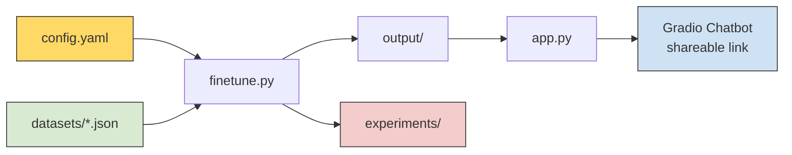
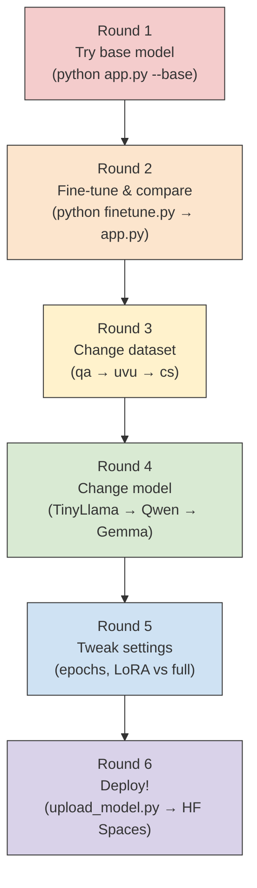

# NLP Fine-Tuning Chatbot — Learning Guide

This guide covers the concepts and techniques used in this project. Read this alongside the code to deepen your understanding.

---

## How This Project Works



**The flow:**
1. You pick a model and dataset in `config.yaml`
2. `finetune.py` loads the base model, tests it (baseline), trains it on your data, tests it again (post-training), and saves everything
3. `app.py` loads the trained model and launches a chat interface
4. Each run is logged to `experiments/` so you can compare across different settings

---

## Suggested Workflow for Students

Here is a recommended order for exploring this project:



### Round 1: See the base model (no training)
```bash
python app.py --base
```
Chat with the **untrained** base model. Ask it questions from your dataset (e.g., "What are UVU's admission requirements?"). Notice how it gives generic or incorrect answers — it has never seen your data.

### Round 2: Fine-tune and compare
```bash
python finetune.py
python app.py
```
Now ask the **same questions**. The model should give much better answers because it learned from your dataset. Check `experiments/` to see the before/after comparison.

### Round 3: Change the dataset
Go back to `config.yaml`, switch to a different dataset (e.g., `cs_assistant.json`), and repeat. Compare how the same model behaves with different training data.

### Round 4: Change the model
Try a different model (e.g., `Qwen/Qwen3-0.6B` or `google/gemma-4-e2b`). Same dataset, different model. How does size affect quality?

### Round 5: Tweak training settings
Try more epochs, different learning rates, or LoRA vs full fine-tuning. Use the experiment comparison (notebook Step 8) to see what matters most.

### Round 6: Deploy for your portfolio
```bash
python upload_model.py
```
Push your best model to HuggingFace and create a permanent Space. See the [deployment section](#deploying-your-chatbot-portfolio) below.

---

## Fine-Tuning Methods: LoRA, QLoRA, and Full

Understanding the difference between fine-tuning approaches is important for choosing the right method for your hardware and goals.

### What is Fine-Tuning?

> **Fine-tuning** takes a pre-trained model (one that already understands language) and trains it further on your specific dataset. Instead of learning language from scratch, the model learns to specialize in your task — like teaching a chef a new recipe instead of teaching them how to cook from zero.

### LoRA (Low-Rank Adaptation)

**LoRA** is a *technique* (not a framework or library) introduced by [Microsoft Research in 2021](https://arxiv.org/abs/2106.09685). It freezes the original model weights and inserts small, trainable matrices into the model's attention layers. Instead of updating billions of parameters, you only train a small fraction (typically 1-5%).

> **How it works:** Imagine the model's knowledge as a huge book. Instead of rewriting the entire book (full fine-tuning), LoRA adds small sticky notes in key places (attention layers) that adjust the model's behavior. The original book stays intact — you only write the sticky notes.

**Read more:** [LoRA: Low-Rank Adaptation of Large Language Models (paper)](https://arxiv.org/abs/2106.09685) | [HuggingFace PEFT docs](https://huggingface.co/docs/peft)

### QLoRA (Quantized LoRA)

**QLoRA** combines LoRA with [quantization](https://huggingface.co/docs/bitsandbytes) — it first compresses the base model to use less memory (4-bit instead of 16-bit), then applies LoRA on top. This lets you fine-tune larger models on less hardware.

> **When to use:** If you want to fine-tune a 7B model (like Mistral) on free Colab, QLoRA makes it possible by reducing the base model's memory footprint by ~4x.

**Read more:** [QLoRA: Efficient Finetuning of Quantized LLMs (paper)](https://arxiv.org/abs/2305.14314) | [bitsandbytes library](https://github.com/bitsandbytes-foundation/bitsandbytes)

### Full Fine-Tuning

**Full fine-tuning** updates *all* parameters in the model. It can produce the best results but requires significantly more GPU memory and time.

> **When to use:** Only if you have access to a powerful GPU (16GB+ VRAM) and want maximum quality. For most student projects, LoRA gives you 90-95% of the quality at a fraction of the cost.

### Comparison Table

| | LoRA | QLoRA | Full Fine-Tuning |
|---|---|---|---|
| **What it does** | Trains small adapter layers | LoRA + quantized base model | Trains all parameters |
| **GPU Memory** | ~4-8 GB | ~2-4 GB | 16+ GB |
| **Training Speed** | Fast | Fast | Slow |
| **Free Colab?** | Yes | Yes | Maybe (small models only) |
| **Quality** | Very Good | Good | Best |
| **Best for** | Most use cases | Large models on limited hardware | Maximum quality |
| **Recommended** | Yes (default) | Advanced users | Advanced users |

### Key Terminology

| Term | What it is |
|---|---|
| **LoRA** | A technique/method — the idea of inserting small trainable matrices |
| **QLoRA** | A variant of LoRA that adds quantization to save more memory |
| **PEFT** | The [Python library](https://github.com/huggingface/peft) by HuggingFace that implements LoRA, QLoRA, and other techniques |
| **bitsandbytes** | The [library](https://github.com/bitsandbytes-foundation/bitsandbytes) that handles quantization (used by QLoRA) |

> **WARNING:** Full fine-tuning requires significantly more GPU memory than LoRA. For a 1B model, expect to need 8-16GB of VRAM. For 3B+ models, you likely need 24GB+. If you run out of memory, switch back to `method: "lora"` in `config.yaml`.

---

## Using Real-World Data

### HuggingFace Datasets

You can fine-tune on any dataset from the [HuggingFace Hub](https://huggingface.co/datasets). Just update `config.yaml`:

```yaml
dataset:
  # Comment out the local path:
  # path: "datasets/qa_bot.json"

  # Use a HuggingFace dataset instead:
  hf_name: "databricks/databricks-dolly-15k"
  hf_split: "train[:500]"               # Use a subset to keep training fast
  hf_instruction_col: "instruction"      # Column containing the input/question
  hf_response_col: "response"            # Column containing the desired output
```

For a detailed walkthrough with multiple examples (Dolly, SQuAD, and more), see `examples/load_hf_dataset.py`:

```bash
python examples/load_hf_dataset.py
```

### Creating Your Own Dataset

Create a JSON file with this format and save it in the `datasets/` folder:

```json
[
  {
    "instruction": "Your question or prompt here",
    "response": "The ideal answer you want the model to learn"
  },
  {
    "instruction": "Another question...",
    "response": "Another ideal answer..."
  }
]
```

Then point to it in `config.yaml`:

```yaml
dataset:
  path: "datasets/my_custom_data.json"
```

### Tips for Good Training Data

- **Start with at least 50-100 examples.** More data generally means better results, but even 50 well-crafted examples can produce noticeable improvements.
- **Be consistent in tone and format.** If you want your bot to respond in a friendly, concise style, make sure all your examples follow that pattern.
- **Cover diverse topics within your domain.** Do not repeat the same question with slight variations — spread out across the range of things you want the bot to handle.
- **Keep responses clear and accurate.** The model will learn to mimic whatever you give it, including mistakes.

---

## Deploying Your Chatbot (Portfolio)

You have two ways to make your chatbot accessible to anyone. Start with the quick Gradio link, then set up a permanent deployment when you're ready.

---

### Option 1: Quick Shareable Link (Gradio Live)

The app already launches with `share=True`, so when you run `python app.py`, Gradio prints a public URL:

```
Running on public URL: https://xxxxx.gradio.live
```

Anyone with the link can try your chatbot. The link stays active for **72 hours**.

**Best for:** Quick demos, sharing with classmates, screenshots for your portfolio.

---

### Option 2: Permanent Deployment on HuggingFace

For a permanent link that stays live (great for resumes), you can deploy to [HuggingFace Spaces](https://huggingface.co/spaces). This involves two steps: uploading your fine-tuned model, then creating a Space that runs your chatbot.

#### Step 1: Push your fine-tuned model to HuggingFace Hub

After fine-tuning, run the upload script to push your model to your HuggingFace account:

```bash
python upload_model.py
```

This will:
- Ask for your HuggingFace username (e.g., `student123`)
- Ask for a model name (e.g., `my-qa-bot`)
- Upload your fine-tuned model to `student123/my-qa-bot` on HuggingFace

> **First time?** You'll need to log in first:
> ```bash
> pip install huggingface_hub
> huggingface-cli login
> ```
> Get your access token from [huggingface.co/settings/tokens](https://huggingface.co/settings/tokens) (create a token with "Write" permission).

#### Step 2: Create a HuggingFace Space

1. Go to [huggingface.co/new-space](https://huggingface.co/new-space)
2. Name your Space (e.g., `my-qa-chatbot`)
3. Select **Gradio** as the SDK
4. Select **CPU basic** (free tier) — this is enough for inference
5. Upload these files to your Space:
   - `app.py`
   - `config.yaml`
   - `data_utils.py`
   - `requirements.txt`
6. Edit `config.yaml` in the Space to point to your uploaded model:
   ```yaml
   training:
     output_dir: "output/"  # The app will download your model here automatically
   ```
7. Edit `app.py` — at the top, add your HuggingFace model ID:
   ```python
   # Add this after the imports to auto-download your model from HuggingFace
   HF_MODEL_ID = "student123/my-qa-bot"  # Replace with your model ID
   ```

> **Or the simple way:** Just upload your entire project folder including the `output/` directory to the Space. This skips the Hub upload step but uses more storage (~500MB-2GB depending on model size). HuggingFace Spaces free tier has 10GB storage.

#### What Students Get

After deployment, you'll have:
- A permanent URL like `https://huggingface.co/spaces/student123/my-qa-chatbot`
- Your model hosted at `https://huggingface.co/student123/my-qa-bot`
- Both are public and can go on your resume/portfolio

---

### Resume / Portfolio Description

Here is an example you can adapt:

> *Fine-tuned a TinyLlama 1.1B language model on a custom Q&A dataset using LoRA (Low-Rank Adaptation). Built an interactive chatbot interface with Gradio and deployed it to HuggingFace Spaces. The project demonstrates end-to-end NLP: dataset preparation, model fine-tuning, experiment tracking, and web deployment. Technologies: Python, PyTorch, HuggingFace Transformers, PEFT, Gradio.*

### Record a Demo

A short screen recording (30-60 seconds) of you chatting with your bot makes a great portfolio addition. Show the chatbot answering a few questions that demonstrate what it learned from your dataset.

---

## Further Reading

- [HuggingFace Transformers Documentation](https://huggingface.co/docs/transformers)
- [PEFT: Parameter-Efficient Fine-Tuning](https://huggingface.co/docs/peft)
- [Gradio Documentation](https://www.gradio.app/docs)
- [LoRA Paper (Hu et al., 2021)](https://arxiv.org/abs/2106.09685)
- [QLoRA Paper (Dettmers et al., 2023)](https://arxiv.org/abs/2305.14314)
