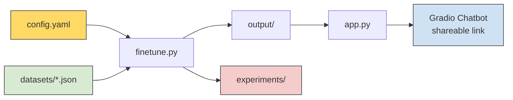

# NLP Fine-Tuning Chatbot Project

Welcome! In this project, you will fine-tune a small language model on a dataset of your choice and deploy it as an interactive chatbot using Gradio.

**What you will learn:**
- How to fine-tune a pre-trained language model using LoRA or full fine-tuning
- How to prepare and swap datasets for different chatbot tasks
- How to compare model performance before and after fine-tuning
- How to build and deploy a web-based chat interface with Gradio

[](https://colab.research.google.com/github/ratulalahy/nlp_course_sample_chat_fine_tune/blob/main/notebook.ipynb)

> For detailed explanations of LoRA, QLoRA, real-world data, and portfolio tips, see [GUIDE.md](GUIDE.md).

---

## Choose Your Path

| | Google Colab (recommended) | Local (Mac/Windows/Linux) |
|---|---|---|
| **Start here** | Click the "Open in Colab" badge above | Follow [Quick Start (Local)](#quick-start-local) below |
| **GPU** | Free T4 GPU (15GB) | Run `python check_system.py` to see what you have |
| **Best models** | TinyLlama, Gemma 4, Phi-3.5 | Qwen3-0.6B (fastest) or TinyLlama |
| **Settings** | `batch_size: 4`, `epochs: 3` | `batch_size: 2`, `epochs: 1` |
| **Training time** | ~1-5 min | ~1-8 min (depends on model) |
| **Sharing** | `python app.py --share` works instantly | `python app.py --share` (may need home network) |

---

## How It Works



| Step | What happens |
|------|-------------|
| 0. `python check_system.py` | Check your hardware & GPU — pick the right model size |
| 1. Edit `config.yaml` | Pick your model, dataset, and training method |
| 2. `python app.py --base` | Chat with the base model (before training) to see how it responds |
| 3. `python finetune.py` | Fine-tune the model — runs baseline test, trains, runs post-training test |
| 4. `python app.py` | Chat with the fine-tuned model — compare the difference! |
| 5. `python app.py --share` | Get a public URL to share your chatbot (72 hours) |
| 6. `python upload_model.py` | Upload model to HuggingFace Hub |
| 7. Create a HuggingFace Space | Deploy permanently — anyone can use your chatbot! |
| 8. Repeat | Change model/dataset/settings, re-run, compare experiments |

---

## Quick Start (Google Colab)

**Recommended:** Click the "Open in Colab" badge above. The notebook walks you through everything step by step.

Or run manually:

```
!git clone https://github.com/ratulalahy/nlp_course_sample_chat_fine_tune.git
%cd nlp_course_sample_chat_fine_tune
!pip install -r requirements.txt -q
!python app.py --base          # Try the base model first
!python finetune.py            # Fine-tune
!python app.py                 # Chat with fine-tuned model
```

## Quick Start (Local)

```bash
git clone https://github.com/ratulalahy/nlp_course_sample_chat_fine_tune.git
cd nlp_course_sample_chat_fine_tune
python -m venv venv
source venv/bin/activate        # On Windows: venv\Scripts\activate
pip install -r requirements.txt
python check_system.py          # Check your hardware first!
python app.py --base            # Try the base model first
python finetune.py              # Fine-tune
python app.py                   # Chat with fine-tuned model
python app.py --share           # Get a public shareable link
```

---

## Project Structure

```
├── notebook.ipynb           # Step-by-step notebook (start here!)
├── config.yaml              # All settings — models, datasets, training params
├── check_system.py          # Check your hardware/GPU before training
├── finetune.py              # Fine-tuning script (LoRA + full)
├── app.py                   # Gradio chat interface (--base, --share flags)
├── data_utils.py            # Data loading utilities
├── datasets/
│   ├── qa_bot.json          # General Q&A (50 examples)
│   ├── uvu_bot.json         # UVU FAQ (50 examples)
│   └── cs_assistant.json    # CS concepts (50 examples)
├── upload_model.py          # Upload fine-tuned model to HuggingFace Hub
├── examples/
│   └── load_hf_dataset.py   # How to use real HuggingFace datasets
├── sample_run/              # Example outputs from a complete run
├── requirements.txt         # Python dependencies
├── GUIDE.md                 # Learning guide (LoRA, data, deployment, portfolio)
└── README.md
```

---

## Three Example Projects

Each example only requires changing **two lines** in `config.yaml`:

### 1. General Q&A Bot
```yaml
model:
  name: "TinyLlama/TinyLlama-1.1B-Chat-v1.0"
dataset:
  path: "datasets/qa_bot.json"
```
```
You:       What is photosynthesis?
Assistant: Photosynthesis is the process by which green plants convert
           sunlight, water, and carbon dioxide into glucose and oxygen.
```

### 2. UVU FAQ Bot
```yaml
dataset:
  path: "datasets/uvu_bot.json"
```
```
You:       How do I apply to UVU?
Assistant: You can apply to UVU online through the university's admissions
           website. UVU has an open-enrollment policy for most programs.
```

### 3. CS Teaching Assistant
```yaml
dataset:
  path: "datasets/cs_assistant.json"
```
```
You:       What is a linked list?
Assistant: A linked list is a linear data structure where each element
           contains data and a pointer to the next node in the sequence.
```

---

## Supported Models

| Model | HuggingFace ID | Size | Free Colab? |
|-------|---------------|------|-------------|
| [TinyLlama](https://huggingface.co/TinyLlama/TinyLlama-1.1B-Chat-v1.0) | `TinyLlama/TinyLlama-1.1B-Chat-v1.0` | ~700MB | Yes |
| [Qwen3 0.6B](https://huggingface.co/Qwen/Qwen3-0.6B) | `Qwen/Qwen3-0.6B` | ~400MB | Yes |
| [SmolLM2](https://huggingface.co/HuggingFaceTB/SmolLM2-1.7B-Instruct) | `HuggingFaceTB/SmolLM2-1.7B-Instruct` | 1.7B | Yes |
| [Llama 3.2 1B](https://huggingface.co/meta-llama/Llama-3.2-1B-Instruct) | `meta-llama/Llama-3.2-1B-Instruct` | 1B | Yes |
| [Gemma 4 E2B](https://huggingface.co/google/gemma-4-e2b) | `google/gemma-4-e2b` | ~5B (10GB) | Colab only |
| [Gemma 4 E4B](https://huggingface.co/google/gemma-4-e4b) | `google/gemma-4-e4b` | ~4B | Yes (LoRA) |
| [Phi-3.5 Mini](https://huggingface.co/microsoft/Phi-3.5-mini-instruct) | `microsoft/Phi-3.5-mini-instruct` | 3.8B | Yes (LoRA) |
| [Llama 3.2 3B](https://huggingface.co/meta-llama/Llama-3.2-3B-Instruct) | `meta-llama/Llama-3.2-3B-Instruct` | 3B | Yes |
| [Mistral 7B](https://huggingface.co/mistralai/Mistral-7B-Instruct-v0.3) | `mistralai/Mistral-7B-Instruct-v0.3` | 7B | LoRA only |

**Start with TinyLlama or Qwen3 0.6B** — they train fast on free Colab and still produce good results.

> Some models (Llama, Mistral) are gated — you may need to accept the license on HuggingFace and run `huggingface-cli login`.

---

## LoRA vs Full Fine-Tuning

| | LoRA (recommended) | Full Fine-Tuning |
|---|---|---|
| **GPU Memory** | ~4-8 GB | 16+ GB |
| **Training Speed** | Fast | Slow |
| **Free Colab?** | Yes | Small models only |
| **Quality** | Very Good | Best |

Switch in `config.yaml`:
```yaml
training:
  method: "lora"    # or "full"
```

> **WARNING:** Full fine-tuning requires 16GB+ GPU memory. If you get an out-of-memory error, switch back to `"lora"`.

For a deeper explanation of LoRA, QLoRA, and how they work, see [GUIDE.md](GUIDE.md#fine-tuning-methods-lora-qlora-and-full).

---

## Deploying for Your Portfolio

| Method | How | Duration | Who can access |
|--------|-----|----------|----------------|
| **Local only** | `python app.py` | While running | Just you |
| **Gradio link** | `python app.py --share` | 72 hours | Anyone with link |
| **HuggingFace Spaces** | Upload model + create Space | Permanent | Anyone on the internet |

### Option 1: Quick Share (Gradio Link)

```bash
python app.py --share           # Prints a public *.gradio.live URL
```

### Option 2: Permanent Deployment (HuggingFace Spaces)

This gives you a permanent URL like `https://huggingface.co/spaces/YOUR_USERNAME/my-chatbot`.

**Step 1: Log in to HuggingFace**

Create a free account at [huggingface.co](https://huggingface.co), then get a [Write token](https://huggingface.co/settings/tokens).

```bash
# Log in (one-time setup)
python -c "from huggingface_hub import login; login()"
# Paste your token when prompted. Say N to "Add token as git credential".
```

**Step 2: Upload your fine-tuned model**

```bash
python upload_model.py
# Enter your username and a model name (e.g., my-cs-bot)
# Or non-interactive: python upload_model.py --username YOUR_NAME --name my-cs-bot
```

Your model will be at `https://huggingface.co/YOUR_USERNAME/my-cs-bot`.

**Step 3: Create a HuggingFace Space**

1. Go to [huggingface.co/new-space](https://huggingface.co/new-space)
2. Name it (e.g., `my-cs-chatbot`), select **Gradio** as the SDK
3. Create two files in the Space:

**`app.py`** — copy from the template in `examples/` or adapt from your local `app.py`. Key change: load the model from HuggingFace Hub instead of `output/`:
```python
BASE_MODEL = "TinyLlama/TinyLlama-1.1B-Chat-v1.0"  # or whichever you used
ADAPTER_REPO = "YOUR_USERNAME/my-cs-bot"              # your uploaded model
```

**`requirements.txt`**:
```
torch>=2.5.0
transformers>=4.51.0
peft>=0.15.0
accelerate>=1.0.0
sentencepiece>=0.2.0
protobuf>=4.25.0
```

4. The Space will build and deploy automatically (~2-3 minutes)
5. Share the URL in your portfolio!

> **Tip:** See a working example at [huggingface.co/spaces/ratulalahy/nlp-cs-chatbot](https://huggingface.co/spaces/ratulalahy/nlp-cs-chatbot)

---

## Hardware & Troubleshooting

**First, run `python check_system.py`** to see your hardware and get tailored recommendations.

### Platform-Specific Notes

| Platform | Device | Recommended Models | Notes |
|----------|--------|-------------------|-------|
| **Google Colab (T4)** | CUDA | All models up to 7B | Best option for students |
| **Mac (Apple Silicon)** | MPS | Qwen3-0.6B, TinyLlama-1.1B | Use `batch_size: 2`, training uses float32 |
| **Windows/Linux (no GPU)** | CPU | Qwen3-0.6B | Slow but works; use `epochs: 1` |
| **Gemma 4 E2B** | CUDA only | Needs ~10GB VRAM | Too large for most local machines |

### Common Issues

| Problem | Solution |
|---------|----------|
| Out of memory (OOM) | Use `method: "lora"`, smaller model, or `batch_size: 1` |
| CUDA not available | On Colab: Runtime > Change runtime type > T4 GPU. Locally: MPS/CPU is used automatically |
| Model not found / 401 | Check model name for typos. Gated models need `huggingface-cli login` |
| "No fine-tuned model found" | Run `finetune.py` first, or try `python app.py --base` for the base model |
| Empty chatbot responses | Try lower temperature (0.3), or train for more epochs |
| Gradio link not working | Use `--share` flag: `python app.py --share`. Check firewall |
| Tokenizer warnings | Safe to ignore — standard behavior when setting pad_token |
| Training very slow | Use Google Colab (free T4 GPU). Locally, reduce `batch_size` and `epochs` |
